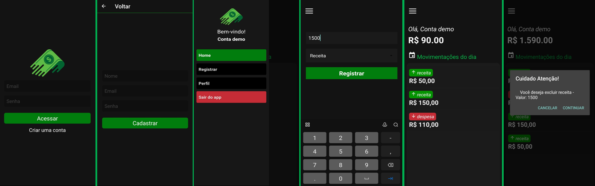

# Aplicativo de finanças com React Native

  

## Objetivo:

### Criar um aplicativo moderno para controle de finanças pessoais, utilizando firebase para criação e autenticação de novos usuários.

## Descrição:

- `Paginas de SignIn e SignUp.`
- `Possibilidade de remover as despesas ou receitas.`
- `Calendario com filtro.`

## <i>Douglas Monteiro</i> 😁🔥🚀
